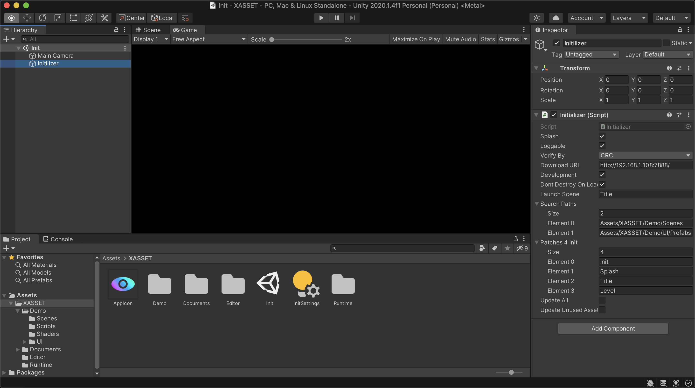
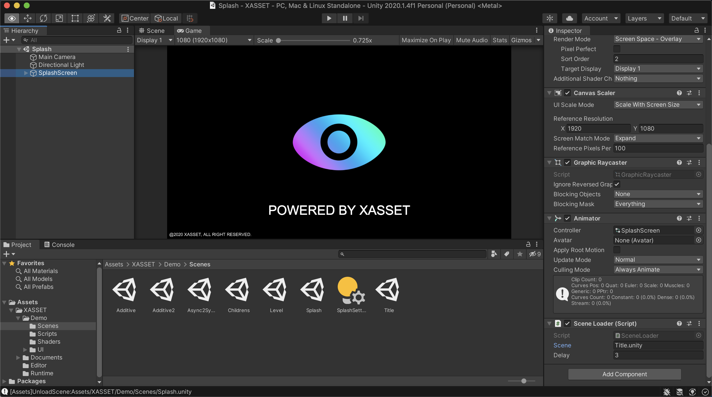
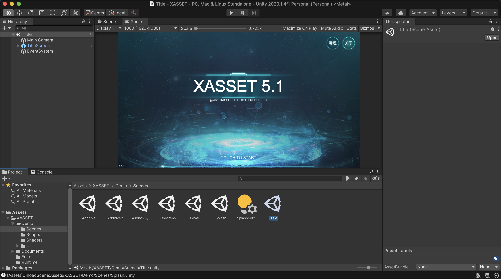
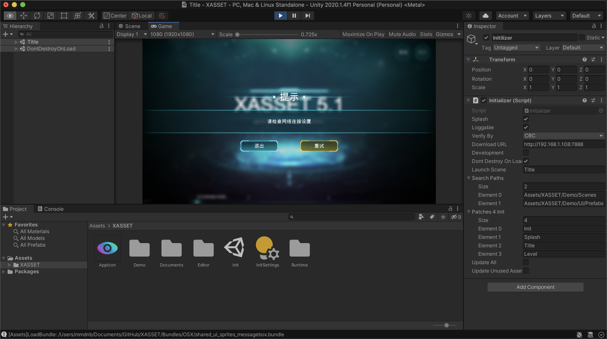
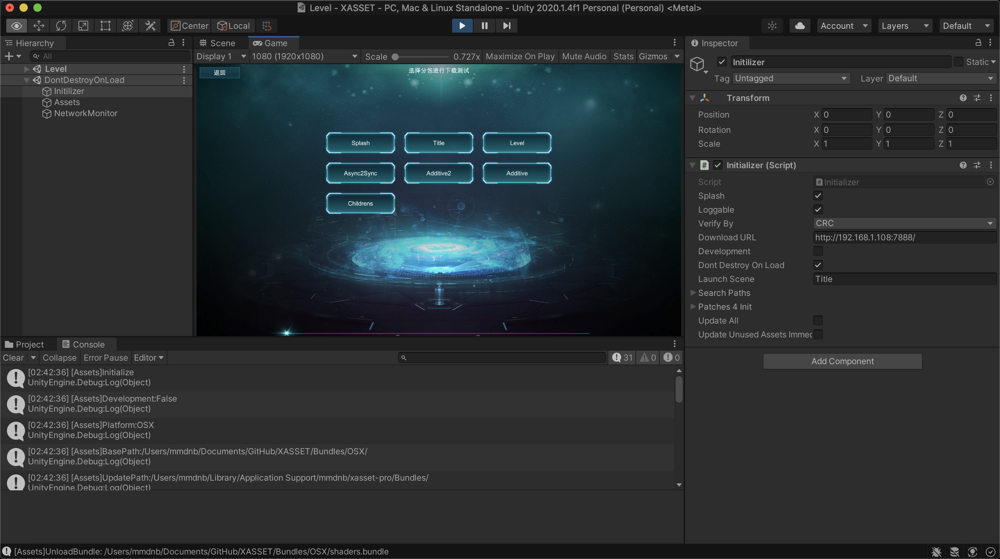
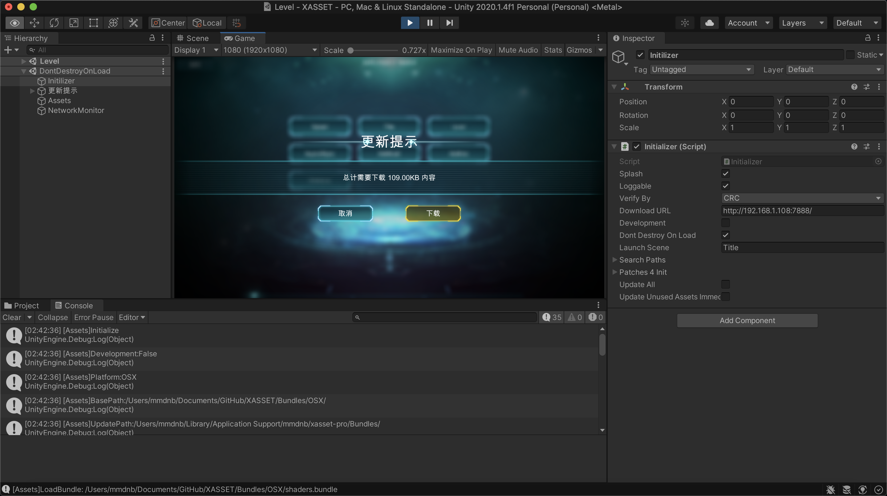

# XASSET 5.1

快速强大的Unity资源系统。

一种最轻便高效和灵活的Unity资源打包，更新，加载，释放方式。

- 官网：https://game4d.cn

- 演示视频：https://www.zhihu.com/people/xasset/zvideos

## 主要特点

- 一键打包，收集资源后自动分析依赖，自动优化冗余，自动解决冲突。大小包出包，配置可控，快速切换，自动按需复制资源到包体，最小包控制在36MB以内，操作简单，快速上手。
- 按需更新，批量下载，断点续传，版本校验，异常复原，自动管理依赖，已经下载的内容无需重复下载，下载后就能使用，轻松查询下载内容的大小进度和速度，功能齐全、使用方便。
- 智能寻址，不论资源是在本地还是服务器，不论资源是在包内还是包外，不论资源是在iOS，Android，Windows，Mac OS等平台，加载资源和场景的逻辑代码，一次编写，到处运行。
- 敏捷开发，编辑器下提供了开发模式支持，无需打包也能快速运行项目，并支持录制模式，通过自动采集资源加载记录，即使成千上万的资源要按需更新，也可，精确定位，轻松处理。
- 稳定可靠，底层采用引用计数进行内存管理，自动管理依赖的加载和释放，即使处理复杂的循环依赖，也能在Profiler中，看到“进多少，出多少”的数据采样表现，根基稳健，更耐考验。

## 入门指南

要快速掌握XASSET 5.1，可以从Demo的以下功能演示开始：

### 初始化

初始化是使用XASSET的Runtime API的第一步，XASSET 5.1提供了Initializer组件对系统进行初始化，打开XASSET下的Init场景可以看到它的属性字段，如下图：



下面是Initializer组件的参数的说明：

- **Splash**

  是否开启闪屏，在Demo中，如果勾选了这个选项，在初始化完成后，会先进入Splash场景展示POWERED BY XASSET的LOGO，3秒后，再通过Splash场景跳转到Title场景。

- **Loggable**

  XASSET系统日志开关，编辑器下支持实时设置。

- **Verify By**

  资源分包下载后的校验方式，默认使用CRC校验，该算法已经在线上用户数达到数百万的产品上验证。

- **Download URL**

  资源下载路径，请配置成指向Bundles的路径。

- **Development**

  开发模式，编辑器下开启后不用打包AssetBundle也能秒进Demo场景。

- **Dont Destroy OnLoad**

  切场景后是否销毁Initializer对象？不销毁可以方便开关日志以及灵敏资源回收的测试。

- **Launch Scene**

  初始化完成后进入的场景，没开启Splash的时候会直接进入这个场景，开启后这个配置无效。

- **Search Paths**

  搜索路径，搜索路径下的资源可以通过文件名称加载，需要注意的是，不同搜索路径下同类型的资源不能重名，否则会发生冲突。

- **Patches 4 Init**

  初始更新的分包配置，主要配置前期需要更新的分包内容，在Demo中默认为Init、Splash、Title、Level场景相关的资源，一般Unity项目都可以参考这个进行配置。

- **Update All**

  开启后会进行整包资源更新，忽略上面的Patches4Init，不需要分包的项目可以开启这个选项。

- **Update Unused Assets Immediate**

  勾选后开启灵敏内存回收模式，默认情况下，常规资源在没有被引用的时候都是在切换场景和低内存以及主动调用了Assets.RemoveUnusedAssets才进行回收，开启这个后，会立即回收。

需要注意的是，和常规Unity项目一样，使用XASSET 5.1的Unity程序的资源分为程序内部和更新目录两部分。在初始化过程中，底层会这样处理覆盖安装的情况：如果程序内部的资源比更新目录的资源版本号高，会根据内部资源的版本记录有针对性的删除更新目录的资源，这样在覆盖安装后，对于部分还在使用中的资源就无需重复下载更新了。

初始化完成后，如果开启了Splash，在Game视图将会跳转到这个场景：



Splash场景会展示3秒左右，主要通过上图中的SceneLoader组件控制，参考Delay字段，3秒后会跳转到Scene字段指定的场景，默认为Title场景，进入Title场景后，出现下面这个画面后点击TOUCH TO START后，就进入初始分包内容更新的环节了：



### 检查网络状态

通常，获取服务器版本信息前，我们需要先检查客户端的网络状态，如果网络不可达，就提示用户检查网络设置，对应的功能界面如下：



下面是检查网络状态的核心代码：

```c#
OnMessage("正在获取版本信息...");
if (Application.internetReachability == NetworkReachability.NotReachable)
{
    MessageBox.Show("提示", "请检查网络连接设置", retry =>
    {
        if (retry)
        {
            StartUpdate();
        }
        else
        {
            Quit();
        }
    }, "重试", "退出");
}
```

### 下载版本信息与初始包内容热更

如果网络没有问题，就直接下载服务器版本信息，下载完成后，如果出现错误会提示用户重新下载更新，如果没有错误，则会根据前面提到的[初始化](###初始化)的配置检查初始阶段的分包内容更新，以下是相关业务的代码片段：

```C#
Assets.DownloadVersions(error =>
{
    if (!string.IsNullOrEmpty(error))
    {
        MessageBox.Show("提示", string.Format("获取服务器版本失败：{0}", error), retry =>
        {
            if (retry)
            {
                StartUpdate();
            }
            else
            {
                Quit();
            }
        });
    }
    else
    {
        Downloader handler;
        // 按分包下载版本更新，返回true的时候表示需要下载，false的时候，表示不需要下载
        if (Assets.DownloadAll(Assets.patches4Init, out handler))
        {
            var totalSize = handler.size;
            var tips = string.Format("发现内容更新，总计需要下载 {0} 内容", Downloader.GetDisplaySize(totalSize));
            MessageBox.Show("提示", tips, download =>
            {
                if (download)
                {
                    handler.onUpdate += delegate(long progress, long size, float speed)
                    {
                        //刷新界面
                        OnMessage(string.Format("下载中...{0}/{1}, 速度：{2}",
                            Downloader.GetDisplaySize(progress),
                            Downloader.GetDisplaySize(size),
                            Downloader.GetDisplaySpeed(speed)));
                        OnProgress(progress * 1f / size);
                    };
                    handler.onFinished += OnComplete;
                    handler.Start();
                }
                else
                {
                    Quit();
                }
            }, "下载", "退出");
        }
        else
        {
            OnComplete(); 
        }
    }
});
```

如果初始分包内容有更新，将会看到下面这个界面：


确定下载后，底层会自动批量下载需要更新的文件，默认最大同时开启5个下载任务，自带断点续传，版本校验，异常恢复等功能，业务层可以通过onUpdate的回调获取下载的进度和速度，下载完成后会通过onFinished完成更新，之后默认会进入选关场景。

### 关卡场景功能与后续包内容热更

关卡场景主要用来演示后续包内容更新，下图展示了选关场景的主要界面：



上图中的每一个按钮都对应一个分包的资源，每一个分包都包含了一个场景，除了Splash、Title、Level外，其余的分包默认都是需要下载更新的，例如，首次点击Async2Sync的时候就会像下面这样提示需要下载更新：



确认下载后，就会显示下载的进度和速度，下载完成后会直接切入分包对应的场景，相关业务代码与[初始分包内容更新](###下载版本信息与初始包内容热更)的部分大同小异，这里就不再一一列举。

选关场景除了提供后续包内容热更外，还提供了以下功能的演示：

#### **异步转同步**

Async2Sync 

异步切同步的演示，同一个资源在异步加载未完成的时候进行同步加载，可以把异步加载立即完成。

#### **循环依赖加载**

Childrens 

循环依赖加载和回收的功能演示，可以通过进出场景的Profiler分析数据测试该功能的稳定性。

#### **附加场景加载**

Additive 

主要通过Additive方式加载了 Additive2.unity，Single场景卸载后，期间加载的Additive场景会自动卸载。

至此，Demo的功能演示场景，基本介绍完毕，下面开始介绍资源打包相关的内容。

### 资源打包的建议

- 对于常规打AB的资源，建议直接使用开发模式自动采集的方式收集资源进行。
- UI贴图静态部分，按使用时机用文件夹进行分组，同一个文件夹一个bundle，一个图集。
- prefab、scene等依赖较多，本身体量不大的资源，通常单个文件一个bundle。
- shader可以全部归集到一个bundle。

### 资源打包配置

#### 自动分包

- **AutoRecord**

  是否自动记录资源的分包分组，开发模式有效。

- **AutoGroupDirectories**

  自动根据目录分组。

#### 首包内容配置

- **AllAssetsToBuild**
  是否整包资源进入Build，开启后会把所有资源Copy到BuildPlayer后的可执行程序中，使用分包的时候需要关闭这个选项。

- **PatchesToBuild**

  BuildPlayer之后的可执行文件包含的分包，配分包名字，底层会自动Copy。

- **ScenesInBuild**

  推荐直接指定 Init 就好，让其他场景都打 Bundle，都可以进行热更。

### 核心接口说明

#### 初始化

- **Assets.Initialize** 

  初始化通过 Callback 返回状态，底层是异步操作，初始化成功后，Runtime 的API 才能正常使用。

#### 资源加载

- **Assets.LoadAsset(Async)**

  加载资源（异步），为减轻业务开发负担，底层在加载出错后会自动Release，底层对于正在异步加载的资源，如果出现同步加载，会采取立即加载完成的操作，实现了异步到同步的无缝切换，但这种操作仅限于针对已经下载好的AB。

- **Assets.LoadSceneAsync**

  异步加载场景，可以加载AB中或者ScensInBuild中的场景，从一个Single场景加载另外一个Single场景的时候，上一个Single场景以及期间加载的Additive场景都会自动回收。

#### 资源更新

- **Assets.DownloadVersions**

  下载服务器的版本文件，正常下载完成后就可以开始检测资源分包的更新状态。

- **Assets.DownloadAll**

  通过分包名称，检查资源分包更新状态，可以指定多个分包，不传分包的时候表示更新所有资源，没有更新的时候返回false，返回true的时候表示有更新。

#### 资源回收

- **Assets.RemoveUnusedAssets**

  清理资源缓存，目前在切换场景和Low Memory的时候底层会自动触发。

- **Assets.UnloadScene**

  卸载场景，场景卸载后会清理缓存。

- **Assets.UnloadAsset**

  卸载资源，默认不会立即回收。

- **Assets.updateUnusedAssetsImmediate**

  立即更新无用资源，开启后资源卸载后立即回收，默认不开启。

### 编辑器工具说明

#### XASSET

- **XASSET/Build/Bundles** 

  一键打资源包，内部会自动 构建规则，有优化空间。

- **XASSET/Build/Player** 

  一键打可执行程序包，会通过编辑器事件函数自动copy首包的资源到可执行程序的包体中。

- **XASSET/Build/Rules**

  一键生成打包配置，缓存了 XASSET/Build/Bundles 需要使用的数据，如果缓存的数据没有修改，可以不需要重复生成。 

- **XASSET/View/Bundles**

  查看打包输出的Bundle文件

- **XASSET/View/Download**

  查看从服务器更新的文件目录

- **XASSET/View/Temp**

  查看下载的缓存目录，从服务器下载的文件会先放到这里，下载完成后再 copy 到 Download 目录

- **XASSET/View/MD5**

  查看文件的MD5

- **XASSET/View/CRC**

  查看文件的CRC

- **XASSET/Copy Bundles**

  复制Bundle文件到StreamingAssets，目前很少用的到了，底层打包的时候会自动触发

- **XASSET/Take Screenshot**

  对 Game 视图截屏

#### Assets

- **Assets/GroupBy/None**

  针对不打Bundle的文件可以设置这个分组，会使用原生格式进行资源更新。

- **Assets/GroupBy/Filename**

  Prefab和Scene都可以使用这个规则进行分组。

- **Assets/GroupBy/Directory**

  UI贴图比较适合这个规则分组。

- **Assets/GroupBy/Explicit/shaders**

  项目中使用的shader可以用这个分组。

- **Assets/PatchBy/CurrentScene**

  对选择资源根据当前场景批量设置分包，当前场景可以在Rules中指定(先在rule设置currentScene)。

## 集成指南

1. 将XASSET文件夹导入到你的项目的工程中。
2. 参考入门指南，按需在项目中接入初始化、资源分包热更新业务。
3. Plus用户购买额外的付费服务可以获得深度解读并协助快速集成到项目中。
4. Pro和Enterprise用户可以获得免费技术支持。

## 问与答

### 如何实现按需更新？

按需更新主要通过分包机制提供支持，分包和分组是两个不同维度的概念，分包决定分组的使用时机，分组决定打包AB的粒度。

### AssetRequest.Require该如何使用?

通常不建议大范围使用Require，实例化的GameObject可以Require一下，然后 Destroy 之后会自动回收，其他的例如贴图之类的资源，不建议使用Require自动回收资源。

### 如何打包和使用spriteatlas？

图集的打包原则是，同一个图集的所有图元打包到同一个AB，对于spritealtas文件，无需单独收集打包，spriteatlas 提供了一种引擎自动后处理构建图集的工作流，在运行时，可以通过加载单张图片让引擎自动加载图集，卸载图片的时候自动卸载图集。

### 为什么File/BuildSettings/ScenesInBuild中多了很多场景？

这个是为了方便编辑器下的场景加载，打包时候会通过后处理自动剔除，可以无视。

### 编辑器测试按需更新和运行时有什么区别为什么？

编辑器下，会从Bundles目录加载资源，所以每次PatchesInBuild中的资源都会是最新，会导致这部分资源不会触发更新，打包后，可以通过下面这个菜单工具：

`XASSET/Copy Bundles`

把Bundles的资源Copy到StreamingAssets。然后，注释掉 EditorInitializer 中这行代码：

`      Assets.basePath = Environment.CurrentDirectory.Replace("\\", "/") + "/" + BuildScript.outputPath + "/";`

这样编辑器下就会去StreamingAssets下寻址，和Runtime环境就一样了，但是在资源体量大的时候，把资源Copy到StreamingAssets会触发漫长Reimport过程，为了优化这个过程，所以编辑器下把打包的资源直接输出在Assets外部的Bundles目录。

## 了解更多

### 商业案例

线上500万+安装次数的大厂大作的选择

#### [Omega Legends](https://play.google.com/store/apps/details?id=com.igg.android.omegalegends&hl=en_US)

Omega Legends is a sci-fi battle royale shooter set in the near future where the game known as "Ω" has taken the world by storm! Select a Hero and make use of their abilities to defeat the competition. Choose to fight alone or team up with friends in intense battles with one hundred participants. Hunt down enemies, build defenses, or take a stealthy approach, do whatever it takes to be the last one standing!


3W+预定用户次数的精品像素游戏的信赖

#### [砰砰军团](https://www.taptap.com/app/192380)

《砰砰军团》是一款实时对战的策略游戏，我们试着去融合视觉和听觉体验，将战斗的动态与音乐的节拍巧妙结合。我们设计了小豆丁这样活泼可爱的造物，并让它们随着鼓点有节奏地战斗，以带给玩家一种全新的游戏体验。我们尽可能地在细节上做到让这些小豆丁的形象变得丰满，战斗之外，还描绘了它们在村子里生活的状态。希望这个游戏不仅可以让玩家体验到紧张，刺激，且欢快的战斗的乐趣，还可以在闲暇之余带给玩家温馨的平和时光。


3个城市不下10家体验店的驾培系统的需要

#### [汽车模拟驾驶器](http://www.carshow.com.cn/)

汽车模拟驾驶器是采用仿真技术通过软硬件，通过视觉、听觉、体感营造真实的驾驶环境和视角，展示汽车驾驶的特性和性能，为驾驶学员提供一个虚拟的可靠的驾驶训练环境。学员可以通过模拟器操作部件在虚拟环境中驾驶学习，发生交互，从而提升驾驶技能。在驾驶人培训中运用模拟驾驶器不仅能提高培训效率和质量，而且能够提高大数据运用能力，增强政府服务和监管的有效性。高效采集、有效整合、充分运用政府数据和社会数据，健全政府运用大数据的工作机制，将运用大数据作为提高政府治理能力的重要手段，不断提高政府服务和监管的针对性、有效性。


### 订阅方案

最大的价值是节约的时间

| Plus            | Pro             | Enterprise      |
| --------------- | --------------- | --------------- |
| 单项目授权      | 单项目授权      | 单项目授权      |
| **￥299/年**    | **￥2999/年**   | **￥29999/年**  |
| 核心源码 + DEMO | 核心源码 + DEMO | 核心源码 + DEMO |
| 1年更新服务支持 | 1年更新服务支持 | 1年更新服务支持 |
| 可选付费解读    | 免费深度解读    | 优先深度解读    |
| -               | 资源内存优化    | 全面性能优化    |
| -               | -               | 功能定制        |

### 用户评价

助您成功是我们的荣誉

#### 大厂大作用户

*“（订阅之前）其实我大概花了有半个月从头写整理项目的资源管理打包这一块然后越搞越多 每个想到遇到的问题 xasset几乎都有现成的并且后续需要分包 剥离resource 也立刻支持了都很符合我项目的需求 我就先花1-2天直接接进来跑给pm看后面就直接说服了 全面转xasset管理资源这一块了”*——来自大厂大作的订阅用户寒晟的真实反馈。

#### 独立游戏用户

*“曾经自己写过使用AssetBundle实现热更的框架，发现有各种各样的内存问题。接入XASSET之后。这一切的问题都轻而易举的解决了； 我曾尝试过5w一年的热更新解决方案，和XASSET在热更环节体验上简直没有区别， 但是XASSET提供了更完善的Unity资源加载和内存管理环境，真的非常棒！”*——来自独立游戏的订阅用户Jason的真实反馈。

### 官方信息

#### 官网

https://game4d.cn

#### 邮箱

[xasset@qq.com](mailto:xasset@qq.com)

#### 群组

QQ群：670850437

#### 微信

### 

## 鸣谢

排名不分先后

- Jojo：XASSET 5.1 官网文案策划，3000RMB赞助。
- Jason：XASSET 5.1 官网技术支持。
- 寒晟：XASSET 5.1 深入测试数据反馈，底层性能优化。
- 糖分不够啊（￣～￣;）：早期文档整理。
- 烟雨迷离半世殇：XASSET MVP。
